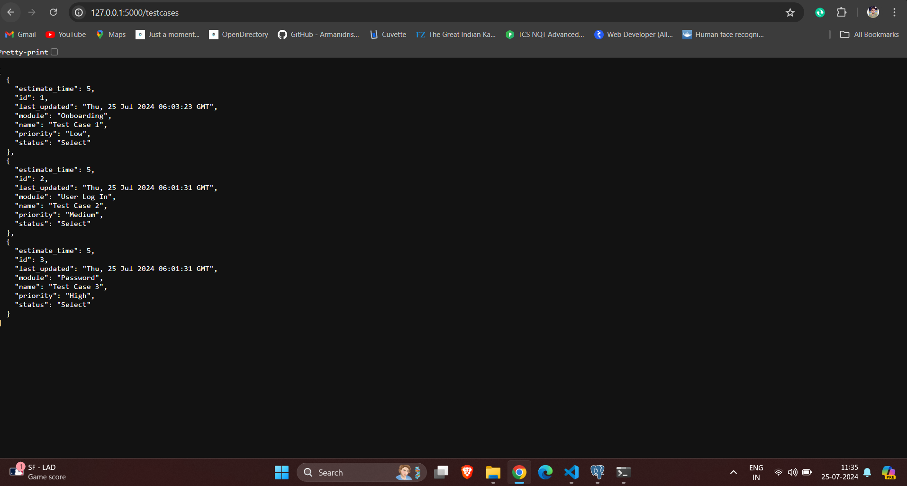

# TestCases Web Application

This is a web application built using Flask that interacts with a PostgreSQL database to manage test cases. The application provides endpoints to retrieve and update test cases.

## Features

### Retrieve Test Cases


Fetch all test cases from the database.

### Update Test Case Status



Update the status of a specific test case.

## Technologies Used

- **Backend**: Flask
- **Database**: PostgreSQL
- **ORM**: SQLAlchemy
- **CORS**: flask-cors
- **Date Handling**: datetime

## Setup and Installation

1. **Clone the repository**:
    ```bash
    git clone <https://github.com/OmkeshwarGupta/Devzery-task>
    cd <backend>
    ```

2. **Create and activate a virtual environment**:
    ```bash
    python -m venv venv
    source venv/bin/activate  # On Windows use `venv\Scripts\activate`
    ```

3. **Install dependencies**:
    ```bash
    pip install -r requirements.txt
    ```

4. **Configuration**: Set up the database URI in `app.config` within the `app.py` file:
    ```python
    app.config['SQLALCHEMY_DATABASE_URI'] = 'postgresql://<username>:<password>@<host>/<database>'
    ```

5. **Initialize the database and seed sample data**:
    ```bash
    python app.py
    ```

## Running the Application

Start the Flask application:

```bash
python app.py
